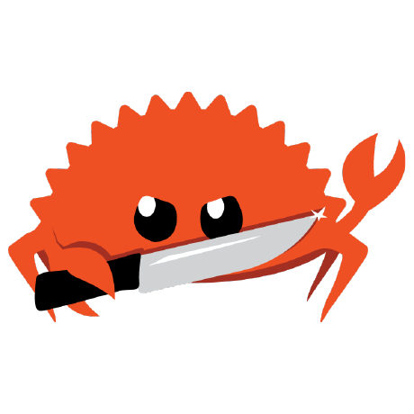

# Rust

<p align="center">

</p>

My journey in learning the Rust programming language.

Consists of notes, projects I work on, practices, and resources I find along the way.

This is a learning process, not finished knowledge.

## A note O_O

Learning a programming language properly has genuinely become harder these days and I think AI is a big reason why. It's so easy to ask an AI for the answer that the brain never gets the chance to struggle, and struggle is where actual learning happens. That's a trap I'm trying to avoid dependcey of AI. I want to enjoy the process, including the confusion, the mistakes, and the huh? moments. That’s where growth actually happens.

So I'm drawing a clear line for myself:

- **AI is allowed for**: cleaning up my notes and writing fixing typos, restructuring messy markdown, explaining concepts I’m stuck on in plain language, and brainstorming ideas.

- **AI is NOT allowed for: writing the actual Rust code.** That's the part I'm here to learn, and outsourcing it to AI would defeat the entire point. I want my brain to struggle with the code, hit errors, read them, fix them, and figure things out on its own. The bugs are the lesson.

## Main resources

- [The Rust Book](https://doc.rust-lang.org/book/) — the official book, my primary source.
- [Rust Book (Brown University interactive edition)](https://rust-book.cs.brown.edu/) — same book with interactive quizzes and visualizations.
- Anything else I find useful along the way.

Someone who inspired me: [@bashbunni](https://github.com/bashbunni) <3. And [this video by Dr. Jonas Birch](https://youtu.be/6e3YDJVPVX8?si=hzkr80oN8Odi7DRJ), which made me realize some stuff.

## Repo structure

```
Rust/
├── README.md              # this file
├── rust-crab.png          # the crab :)
│
├── the-book/              # my notes from working through "The Rust Book"
│
├── projects/              # small projects I write while learning (based on the book)
│
└── resources/             # links and references I want to keep around
```

If you want to join me in this learning journey, feel free to reach out >.<

## Progress

- [ ] 1 — Getting Started
- [ ] 2 — Programming a Guessing Game
- [ ] 3 — Common Programming Concepts
- [ ] …
